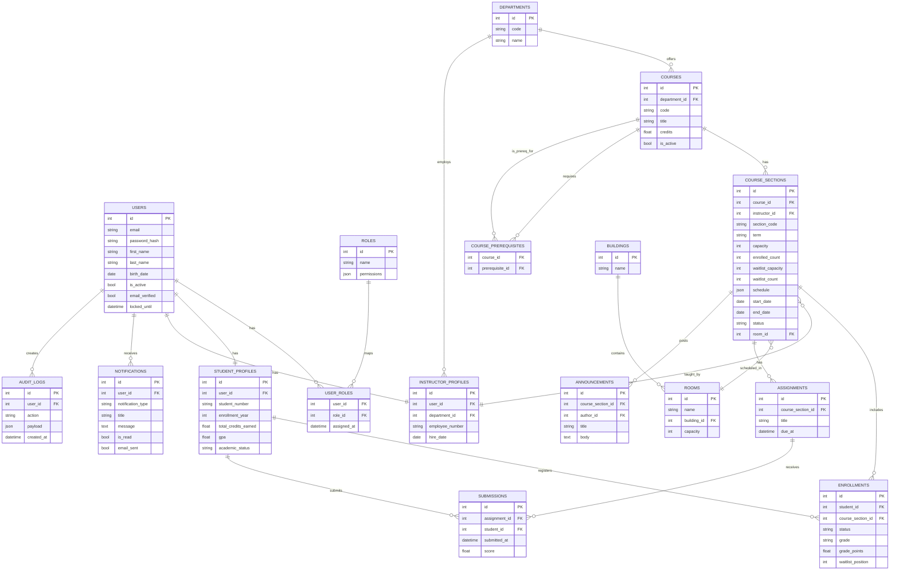

# Database ER Diagram

This Mermaid ER diagram outlines the normalized schema used by the project.

```mermaid
erDiagram
    USERS ||--o{ USER_ROLES : has
    USERS ||--|| STUDENT_PROFILES : has
    USERS ||--|| INSTRUCTOR_PROFILES : has
    USERS ||--o{ NOTIFICATIONS : receives
    USERS ||--o{ AUDIT_LOGS : creates

    ROLES ||--o{ USER_ROLES : maps

    DEPARTMENTS ||--o{ COURSES : offers
    DEPARTMENTS ||--o{ INSTRUCTOR_PROFILES : employs

    COURSES ||--o{ COURSE_SECTIONS : has
    COURSES ||--o{ COURSE_PREREQUISITES : requires
    COURSES ||--o{ COURSE_PREREQUISITES : is_prereq_for

    COURSE_SECTIONS ||--o{ ENROLLMENTS : includes
    COURSE_SECTIONS }o--|| INSTRUCTOR_PROFILES : taught_by
    COURSE_SECTIONS }o--|| ROOMS : scheduled_in
    COURSE_SECTIONS ||--o{ ASSIGNMENTS : has
    COURSE_SECTIONS ||--o{ ANNOUNCEMENTS : posts

    STUDENT_PROFILES ||--o{ ENROLLMENTS : registers
    STUDENT_PROFILES ||--o{ SUBMISSIONS : submits

    ASSIGNMENTS ||--o{ SUBMISSIONS : receives

    BUILDINGS ||--o{ ROOMS : contains

    USERS {
        int id PK
        string email
        string password_hash
        string first_name
        string last_name
        date birth_date
        bool is_active
        bool email_verified
        datetime locked_until
    }
    ROLES {
        int id PK
        string name
        json permissions
    }
    USER_ROLES {
        int user_id FK
        int role_id FK
        datetime assigned_at
    }
    STUDENT_PROFILES {
        int id PK
        int user_id FK
        string student_number
        int enrollment_year
        float total_credits_earned
        float gpa
        string academic_status
    }
    INSTRUCTOR_PROFILES {
        int id PK
        int user_id FK
        int department_id FK
        string employee_number
        date hire_date
    }
    DEPARTMENTS {
        int id PK
        string code
        string name
    }
    COURSES {
        int id PK
        int department_id FK
        string code
        string title
        float credits
        bool is_active
    }
    COURSE_PREREQUISITES {
        int course_id FK
        int prerequisite_id FK
    }
    COURSE_SECTIONS {
        int id PK
        int course_id FK
        int instructor_id FK
        string section_code
        string term
        int capacity
        int enrolled_count
        int waitlist_capacity
        int waitlist_count
        json schedule
        date start_date
        date end_date
        string status
        int room_id FK
    }
    ENROLLMENTS {
        int id PK
        int student_id FK
        int course_section_id FK
        string status
        string grade
        float grade_points
        int waitlist_position
    }
    ASSIGNMENTS {
        int id PK
        int course_section_id FK
        string title
        datetime due_at
    }
    SUBMISSIONS {
        int id PK
        int assignment_id FK
        int student_id FK
        datetime submitted_at
        float score
    }
    ROOMS {
        int id PK
        string name
        int building_id FK
        int capacity
    }
    BUILDINGS {
        int id PK
        string name
    }
    NOTIFICATIONS {
        int id PK
        int user_id FK
        string notification_type
        string title
        text message
        bool is_read
        bool email_sent
    }
    ANNOUNCEMENTS {
        int id PK
        int course_section_id FK
        int author_id FK
        string title
        text body
    }
    AUDIT_LOGS {
        int id PK
        int user_id FK
        string action
        json payload
        datetime created_at
    }
```
